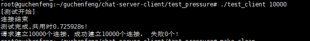
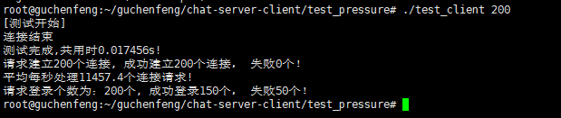
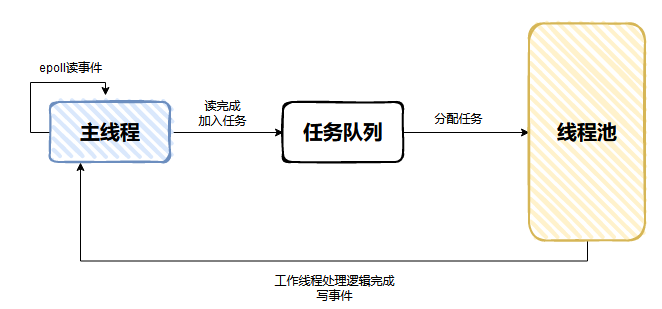
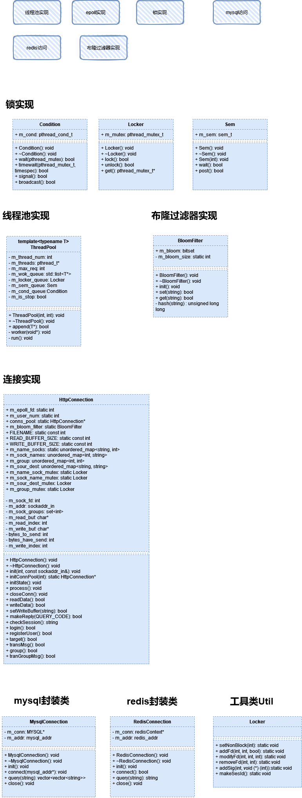

# Linux聊天室服务器

> Linux下c++轻量级聊天服务器(含客户端)，面向对象编程，便于理解和部署。

## 技术选型

- 使用**线程池** + **互斥锁信号量** + **非阻塞IO** + **epoll多路IO复用(ET模式)** + **事件处理**(模拟Proactor)的并发模型。
- 使用**Mysql**维护用户的**注册**与**登录**信息。
- 使用**Redis**记录用户**会话状态**。
- 自己编写的压力测试可以支持**上万**的连接，查询**Mysql**数据库**登录**支持**上百**的请求。

## 开发环境

- ubuntu 20.04 (1核2GB)
- c++11
- Mysql 8.0.32
- Redis 5.5.0
- hiredis库
- libmysqlclient-dev库

## 设计思路

> 实现服务器登录、注册、转发消息、广播群组消息等功能。

1、**Mysql**记录客户的账号与密码，保存在数据库**test_connect**的表**user**中。

2、**Redis**记录会话id，设置过期时间，在会话过期之前，客户端可**免登录**。

3、**布隆过滤器**(bitset + 字符串哈希)应对**缓存穿透**，对于用户信息不存在于数据库的登录请求过滤。

4、**IO多路复用 + 线程池**，采用**epoll**的**边缘触发**模式，自己实现了**线程池**与**封装锁类**来提供线程安全和提高并发。

## 使用说明

1、首先在服务端创建一个数据库叫 **test_connect**，再创建一个表叫 **user**保存用户名和密码，表有两个 VARCHAR 类型属性：**name**和 **password**，并将 **name**设为主键。

2、然后修改 server.cpp 代码中的 ip 地址，更改为自己的服务器 ip 地址。

3、启动 Mysql、redis 服务。

4、执行 **make clean**命令清除旧目标代码，再执行**make**得到可执行文件 **client、server**。

5、用一个终端先运行 **server**。

6、再开另外一个或多个终端运行 **client**。

## 压力测试

> 向**user**表中预先插入10000条用户数据，然后编写请求连接和登录的客户端压测程序，客户端登录的用户名和密码从**cookie.txt**中获得。
>
> 经测试，**连接可支持上万**，但可能是查询数据库性能的原因，**登录查询数据库**的请求只支持**上百**。

**连接：**

**连接 + 登录:**

## 文件介绍

- test_pressure ：压测文件夹，含有压力测试文件及压测说明。
- bloom_filter.h 、bloom_filter.cpp ：布隆过滤器类的头文件与实现。
- mysql_connection.hpp ：mysql连接类的声明定义。
- redis_connection.hpp ：redis连接类的声明定义。
- http_connection.h、http_connection.cpp ：连接类的头文件与实现，对应每个已连接的socket。
- locker.hpp ：线程锁的封装类，包括互斥锁、信号量、条件变量锁。
- thread_pool.hpp ：线程池类的实现。
- util.hpp ：工具类的实现，用于辅助修改描述符的状态、信号捕捉、会话id生成。
- server.cpp ：服务器程序的入口。
- client.cpp ：客户端程序的入口。

## 框架

> 采用模拟proactor模式，主线程除了接受请求还需要模拟内存负责读写，工作线程处理逻辑。

## 部分实现类的UML图

